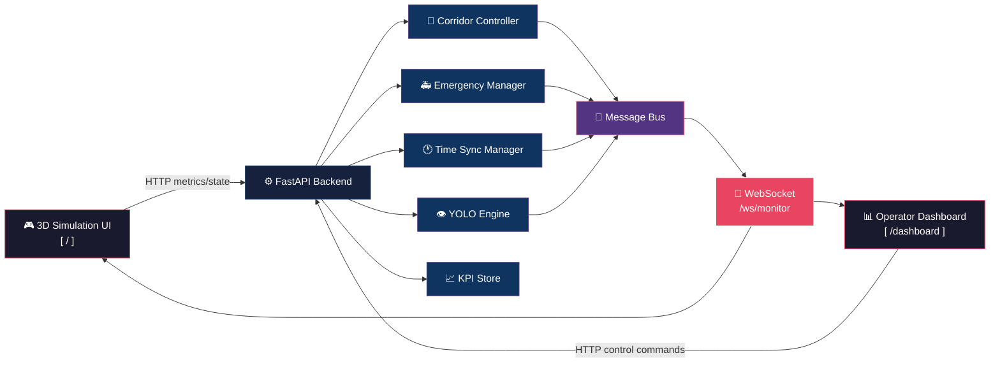

<p align="center">
  
</p>

<p align="center">
  <a href="https://www.python.org/"></a>
  <a href="https://fastapi.tiangolo.com/"></a>
  <a href="https://www.uvicorn.org/"></a>
  <a href="https://threejs.org/"></a>
  <a href="https://nixpacks.com/"></a>
  <a href="https://websockets.spec.whatwg.org/"></a>
</p>

<p align="center">
  <strong>🧠 Production-style digital twin for intelligent corridor traffic control.</strong><br/>
  Real-time 3D simulation &nbsp;·&nbsp; Adaptive signal planning &nbsp;·&nbsp; Emergency routing &nbsp;·&nbsp; Live event streaming
</p>

<p align="center">
  <a href="http://127.0.0.1:8000/"></a>
  <a href="http://127.0.0.1:8000/dashboard"></a>
  <a href="LICENSE"></a>
</p>

---

## 🗺️ Table of Contents

| # | Section |
|:---:|:--------|
| 01 | [System Overview](#-system-overview) |
| 02 | [Key Features](#-key-features) |
| 03 | [Architecture](#-architecture) |
| 04 | [Tech Stack](#-tech-stack) |
| 05 | [Project Structure](#-project-structure) |
| 06 | [Quick Start](#-quick-start) |
| 07 | [Configuration](#-configuration) |
| 08 | [API Surface](#-api-surface) |
| 09 | [Deployment](#-deployment) |
| 10 | [Operational Notes](#-operational-notes) |
| 11 | [Project Member](#-project-member) |
| 12 | [Contributing](#-contributing) |

---

## 🧩 System Overview

```
╔══════════════════════════════════════════════════════════════════╗
║   TANCAM simulates and controls a multi-intersection corridor    ║
╠══════════════════════════════════════════════════════════════════╣
║  🖥️ Backend    →  Computes adaptive plans from traffic metrics  ║
║  🎮 Simulation →  Visualizes traffic dynamics + applies plans   ║
║  📊 Dashboard  →  Operators trigger actions & monitor events    ║
║  📡 WebSocket  →  Streams plans, health & alerts in real-time   ║
╚══════════════════════════════════════════════════════════════════╝
```

---

## 🌟 Key Features

| Feature | Description |
|:---:|:---|
| 🟢 **Adaptive Planning** | Cycle and split planning per intersection |
| 🌊 **Green Wave** | Dynamic offsets across corridor links |
| 🚑 **Emergency Routing** | BFS pathfinding over corridor topology |
| 🧯 **Failure Injection** | `network_outage` · `camera_failure` · `low_visibility` · `node_crash` |
| ❤️ **Health Monitor** | Live health + clock drift monitoring |
| 👁️ **YOLO Vision** | Mock & real Ultralytics inference paths |
| 📊 **KPI Engine** | Intersection & corridor-level KPI ingestion |
| 📡 **Live Streaming** | Multiplexed WebSocket event bus |

---

## 🏗️ Architecture



---

## 🛠️ Tech Stack

| Layer | Technology | Role |
|:---:|:---|:---|
| 🔧 **Backend API** |  | REST endpoints + async logic |
| ⚡ **ASGI Server** |  | High-performance async server |
| 🎨 **Templating** |  | Server-side HTML rendering |
| 🌐 **Simulation** |  | 3D corridor visualization |
| 📨 **Messaging** | `async pub/sub` | In-process event message bus |
| 🤖 **CV Pipeline** |  | Mock or Ultralytics-backed |
| 🚀 **Deployment** |  | Platform-native buildpack |

---

## 📁 Project Structure

```
🚦 tancam/
│
├── 📂 backend/
│   ├── 📂 corridor/          ← Adaptive signal planning logic
│   ├── 📂 messaging/         ← Async pub/sub message bus
│   ├── 📂 system/
│   │   └── 📂 data/
│   │       └── 📄 corridor_topology.json
│   └── 📂 vision/            ← YOLO inference (mock + real)
│
├── 📂 static/
│   ├── 📂 css/
│   ├── 📂 js/
│   └── 📂 models/
│
├── 📂 templates/
│   ├── 🌐 index.html         ← 3D simulation page
│   └── 📊 dashboard.html     ← Operator dashboard
│
├── 🐍 webapp.py              ← FastAPI app entry
├── ▶️  start.py              ← Dev launcher
├── 📋 requirements.txt
└── 📦 nixpacks.toml          ← Deployment config
```

---

## 🚀 Quick Start

### ✅ Prerequisites

- **Python 3.10+**

### ▶️ Installation

```bash
# 1. Clone the repository
git clone https://github.com/log0207/tancam.git
cd tancam

# 2. Install dependencies
pip install -r requirements.txt

# 3. Launch the application
python start.py
```

### 🌐 Open in Browser

| Interface | URL | Description |
|:---:|:---|:---|
| 🎮 **Simulation** | `http://127.0.0.1:8000/` | Live 3D corridor view |
| 📊 **Dashboard** | `http://127.0.0.1:8000/dashboard` | Operator control panel |

> **Alternative:** `uvicorn webapp:app --reload --host 127.0.0.1 --port 8000`

---

## 🔧 Configuration

| Variable | Default | Purpose |
|:---|:---:|:---|
| `MULTI_INTERSECTION` | `true` | Enable multi-intersection mode |
| `YOLO_ENABLED` | `false` | Toggle YOLO vision pipeline |
| `CORRIDOR_ENABLED` | `false` | Enable corridor planning |
| `TWO_TIER_ENABLED` | `true` | Two-tier control architecture |
| `YOLO_BACKEND` | `mock` | `mock` or `real` YOLO mode |
| `YOLO_MODEL_PATH` | _(empty)_ | Path to Ultralytics model |
| `PORT` | _(platform)_ | Bind port for production |

> 💡 `start.py` supports `--env-file` flag (defaults to `.env`). In production, configure via your platform's secret manager.

---

## 🧪 API Surface

<details>
<summary>🖥️ <strong>UI Routes</strong></summary>
<br/>

```
GET  /           →  3D Simulation page
GET  /dashboard  →  Operator dashboard
```

</details>

<details>
<summary>❤️ <strong>Health &amp; Topology</strong></summary>
<br/>

```
GET  /api/health
GET  /api/system/health
GET  /api/topology
PUT  /api/topology
```

</details>

<details>
<summary>🚗 <strong>Intersection Inputs</strong></summary>
<br/>

```
POST /api/intersections/{id}/metrics
POST /api/intersections/{id}/state
GET  /api/intersections/state
POST /api/intersections/{id}/kpi
```

</details>

<details>
<summary>🎛️ <strong>Planning &amp; Control</strong></summary>
<br/>

```
GET  /api/corridor/plan
GET  /api/control/strategy
PUT  /api/control/strategy
POST /api/control/command
GET  /api/control/commands
```

</details>

<details>
<summary>🚑 <strong>Emergency &amp; Vision</strong></summary>
<br/>

```
GET  /api/emergency/active
POST /api/vision/detect
POST /api/vision/detect/batch
```

</details>

<details>
<summary>📈 <strong>KPI</strong></summary>
<br/>

```
GET  /api/kpi/summary
POST /api/kpi/reset
```

</details>

<details>
<summary>📡 <strong>WebSocket</strong></summary>
<br/>

```
WS   /ws/monitor  →  Multiplexed stream: metrics · plans · health · alerts
```

</details>

---

## 🌍 Deployment

This repository ships **Nixpacks-ready** for platforms like Render, Railway, and any Nixpacks-compatible host.

### 🚀 Deploy in 5 Steps

```
1. Create a new web service on Render / Railway
2. Platform auto-detects nixpacks.toml ✅
3. Set environment variables in platform settings
4. Deploy 🎉
```

---

## 📝 Operational Notes

> ⚠️ **Important runtime behaviors to know:**

- 📍 Topology data lives in `backend/system/data/corridor_topology.json`
- 💾 Message bus and KPI store are **in-memory** — restart clears runtime history
- 🤖 YOLO defaults to **mock mode**; real mode requires Ultralytics + a model file

---

## 👥 Project Member

<p align="center">
  <table>
    <tr>
      <td align="center">
        <a href="https://github.com/swetha15-26">
          <br/>
          <sub><b>Swetha</b></sub>
        </a><br/>
        <a href="https://github.com/swetha15-26">
          
        </a>
      </td>
    </tr>
  </table>
</p>

---

## 🤝 Contributing

We welcome contributions! Here's how to get started:

```
1. 🍴 Fork the repository
2. 🌿 Create a feature branch    →  git checkout -b feat/your-feature
3. 💾 Make focused commits        →  git commit -m "feat: description"
4. 📬 Open a Pull Request         →  with clear testing notes
```

<p align="center">
  <a href="https://github.com/log0207/tancam/pulls">
    
  </a>
  <a href="https://github.com/log0207/tancam/issues">
    
  </a>
</p>
<p align="center">
  
</p>

<p align="center">
  <sub>Built with ❤️ for intelligent city infrastructure &nbsp;·&nbsp; Techno Warriors © 2026</sub>
</p>
